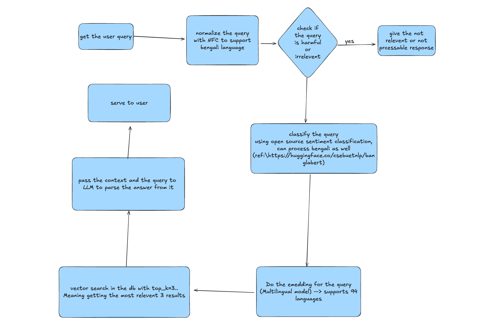
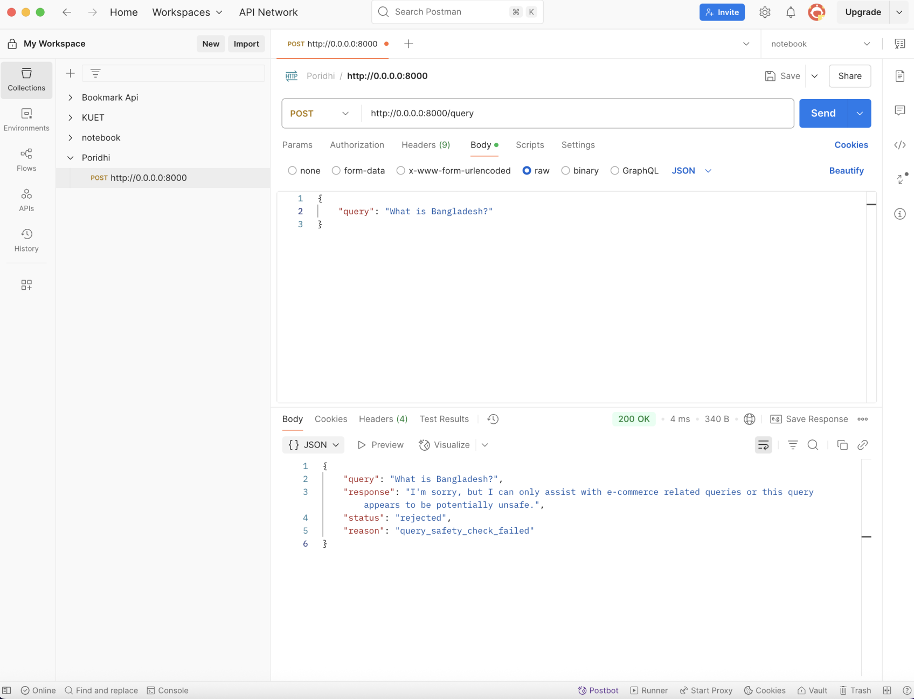

### Seeksense - The system that can understand user intent


## 🌟 System Design




## 🌟 Features

- **Intent Classification**: Accurately identifies user query intent for better results
- **Content Safety**: Filters inappropriate or harmful queries
- **Semantic Search**: Uses vector embeddings for meaning-based retrieval
- **Bilingual Support**: Handles both Bengali and English queries
- **Kubernetes Deployment**: Ready for containerized deployment

## VectorDatabse

we used milvus vector database for semantic search which is most well known for its perfomence and deployment in production. Which can be deployed in standalone or in distributed manner to handle large scale production deployment.

## EmbeddingModel

We used Jina AI embedding model for generating embeddings for text data. it is a multilingual model that can generate embeddings for Bengali and English text data. Also supporing more than 94 languages. So it can be used for generating embeddings for any language. This model is also open sourced that we can deploy in house but due to resource limitation we had to use the api from them. [HF REF](https://huggingface.co/jinaai/jina-embeddings-v3)


## Experiments

We did some experiments to find the best model for generating embeddings for text data. We also did experiment with the gguf models to deploy in house but due to resource limitation we had to use the api from them. Here are the experiment results:

### Gaurdrails/Handeling Irrelevent Queries


### Embedding Models


### LLM Models

we did experiments with open source gguf models out there those gguf models perfomence is not good also a 3b gguf model takes 4gbs of ram and more than 100% of the cpu usages and due to resource constraint we are not being able to deploy them in house. So we considered using groqs llama 3 8b model which use LPU for inference where we can get faster response then any other model with being cost effective


## Cost Analysis

Here’s a breakdown of the projected API costs for processing 100 000 products, based on your provided rates and observed token usage for 4 000 products.  

### 1. Assumptions & Scaling Factor  
- **Observed embedding usage**: 600 000 tokens for 4 000 products → **150 tokens per product**.  
- **Scaling to 100 000 products**:  
  \[
    150\ \tfrac{\text{tokens}}{\text{product}} \times 100\,000\ \text{products} 
    = 15\,000\,000\ \text{tokens}
  \]  

### 2. Embedding Costs (Jina AI)  
- **Rate**: \$0.018 per 1 000 000 tokens  
- **Embedded tokens**: 15 000 000 tokens  
- **Cost**:  
  \[
    15\ \times \$0.018 = \$0.27
  \]  

### 3. LLM Costs (gorq Llama 3 8B 8K)  
We’ll assume to consume the same 15 M tokens for each direction (input & output) when generating response

| Direction | Total Tokens | Rate                              | Cost                        |
|-----------|--------------|-----------------------------------|-----------------------------|
| **Input** | 15 000 000   | \$1 per 12.5 M tokens             | \(\frac{15}{12.5}×\$1 = \$1.20\)  |
| **Output**| 15 000 000   | \$1 per 20 M tokens               | \(\frac{15}{20}×\$1 = \$0.75\)    |
| **Subtotal** | —          | —                                 | **\$1.95**                  |


### 4. Grand Total for 100 000 Products  

| Component               | Cost    |
|-------------------------|---------|
| Embeddings (Jinai)      | \$0.27  |
| LLM Input (gorq Llama)  | \$1.20  |
| LLM Output (gorq Llama) | \$0.75  |
| **Total**               | **\$2.22** |

---

#### Summary  
- **Embeddings**: \$0.27  
- **LLM generation**: \$1.95  
- **Overall**: **\$2.22** to process and generate README markdown for 100 000 products under the given token‐usage profile.  


## 💻 Components

- **Query Filter**: Blocks harmful or irrelevant queries
- **Intent Classifier**: Identifies user intent behind queries
- **Vector Store**: Milvus-based semantic search
- **LLM Integration**: Uses large language models for response generation(LLama 3 8b for cost efficiency)
- **API Service**: FastAPI-based REST interface

## Kubernetes Deployment
SeekSense includes Kubernetes manifests for production deployment

1. Create the namespace:
    ```bash
    kubectl apply -f deployments/namespace.yaml
    ```

2. Deploy the storage components:
    ```bash
    kubectl apply -f deployments/data_pv.yaml
    kubectl apply -f deployments/data_pvc.yaml
    ```

3. Deploy Milvus:
    ```bash
    kubectl apply -f deployments/milvus-deployment.yaml
    ```

4. Deploy the intent classifier:
    ```bash
    kubectl apply -f deployments/intent-classification.yaml
    ```

5. Deploy the API service:
    ```bash
    kubectl apply -f deployments/api-service.yaml
    ```


## Project Structure
```
SeekSense/
├── app.py                      # FastAPI application
├── classification/             # Intent classification
│   ├── intent_classification.py
│   ├── llm.py                  # LLM integration
│   └── query_filter.py         # Content safety
├── data_processing/            # Data processing
│   ├── embedding.py            # Embedding models
│   └── preprocessing.py        # Text preprocessing
├── databases/                  # Database connections
│   └── vector_store.py         # Milvus integration
├── deployments/                # Kubernetes manifests
│   ├── api-service.yaml
│   ├── configmap.yaml
│   ├── data_pv.yaml
│   ├── data_pvc.yaml
│   ├── intent-classification.yaml
│   ├── milvus-deployment.yaml
│   └── namespace.yaml
└── scripts/                    # Utility scripts
    ├── drop_miluv_coll.py
    ├── indexing.py
    └── setup-cluster.sh
```
## Acknowledgments
BUET CSE NLP Group for research on Bengali language models(https://huggingface.co/csebuetnlp/banglabert)
Milvus Vector Database
Groq for LLM inference
Jina AI for Embedding(https://huggingface.co/jinaai/jina-embeddings-v3)